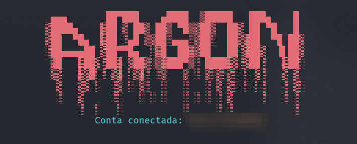

# self-bot



## funcionalidades
- comando de ``!nuke`` deleta todos os tipos de canais e categorias do servidor, também altera o nome do servidor.

## instalação

Após clonar o repositório, execute o comando abaixo em seu terminal:
```bash
npm install ou yarn install
```

Renomeie o arquivo ``.env.example`` para `.env` e coloque o token da sua conta para conectar o self-bot.

## scripts
O comando abaixo vai deixar o compilador do Typescript monitorando qualquer mudança na pasta `src`. É necessário rodar esse comando pela primeira vez para compilar e gerar a pasta `dist`
```bash
npm run start:ts
```

O comando abaixo vai deixar com que o self-bot fique ligado e qualquer alteração nos arquivos ele irá recarregar automaticamente. Monitora o arquivo `App.js` na pasta `dist`
```bash
npm run start:js
```